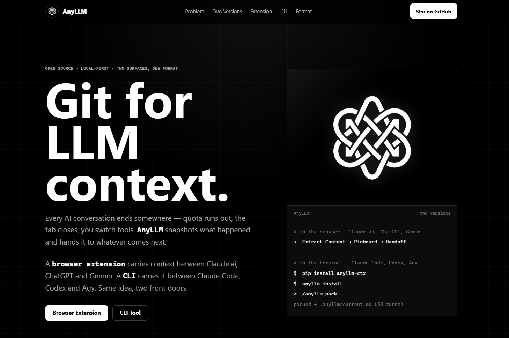

# AnyLLM — Git for LLM Context

Every AI conversation ends somewhere — quota runs out, the context window fills, you switch tools, or you just come back tomorrow. **AnyLLM** snapshots what happened and hands it to whatever comes next.



It ships as two surfaces that share one idea:

| | Surface | Carries context between | Where it lives |
|---|---|---|---|
| 🧩 | **Browser Extension** | Claude.ai, ChatGPT, Gemini | `src/` (this repo root) |
| ⌨️ | **CLI** (`anyllm-ctx`) | Claude Code, Codex, Agy, Kiro, Kilocode, OpenCode, Cursor | [`cli/`](cli/) |

Demo: https://anyllm.vercel.app/

---

## Repo layout

```
anycapsule/
├── src/              # Browser extension source (Manifest V3)
│   ├── adapters/      # adapter.js — PlatformAdapter base + Claude/ChatGPT/Gemini adapters
│   ├── components/     # Injected UI: side panel, banners, toolbars
│   ├── services/       # Context extraction, pinboard, highlights, delete, handoff, storage
│   ├── background.js    # Service worker — message routing, cross-tab handoff
│   ├── content.js        # Content script entry point
│   └── popup.html/js/css # Toolbar popup
├── manifest.json      # Extension manifest (Manifest V3)
├── vite.config.js     # Build config (vite-plugin-web-extension)
├── cli/                # Python CLI package — "Git for LLM context" for coding agents
│   ├── src/anyllm/       # ingestors, distiller, merger, composer, injectors, integrations
│   ├── tests/
│   └── README.md         # Full CLI documentation
├── landing/            # Static marketing page (no build step)
└── docs/               # Design notes / working docs
```

---

## Browser Extension

A Manifest V3 extension that works inside the conversation itself — no server, no account.

**Features**

- **Extract Context** — scans the thread for decisions, next steps, code blocks, and topics, then condenses it into a structured summary.
- **Context Handoff** — packages that extraction into a ready-to-paste briefing. Deliver it via clipboard, the pinboard, or straight into a new tab on another platform.
- **Pinboard** — pin any message, reorder by drag-and-drop, persisted per conversation.
- **Highlights** — select text and mark it yellow, green, or red; anchored to the DOM via relative XPath so it survives reloads.
- **Soft Delete & Bulk Mode** — hide messages from view locally (never mutates the actual conversation), toggle visibility, or bulk-select and clear several at once.
- **Local-first storage** — everything lives in `chrome.storage` on your machine.

**Supported platforms:** `claude.ai`, `chat.openai.com` / `chatgpt.com`, `gemini.google.com`.

### Architecture

```
popup.js ──message──▶ content.js ──▶ adapters/adapter.js   (DOM in, structured messages out)
                                  └─▶ services/*             (contextExtractor, pinService,
                                                               highlightService, deleteService,
                                                               handoffService, storage)
                                  └─▶ components/*           (ContextSidePanel, PinboardPanel,
                                                               HighlightsPanel, HandoffBanner)
background.js  ── service worker: install lifecycle, cross-tab handoff delivery
```

`src/adapters/adapter.js` holds the shared `PlatformAdapter` base class plus `ClaudeAdapter`, `ChatGPTAdapter`, and `GeminiAdapter` — one file, one interface (`getMessageElements()`, `extractMessageData()`, `getConversationId()`, etc.). Services never touch the DOM directly for data — they consume whatever the adapter returns, so adding a new platform means adding one class in that file, not touching every feature.

### Run it locally

```bash
npm install
npm run dev     # vite build --watch
```

Then in Chrome: `chrome://extensions` → enable **Developer mode** → **Load unpacked** → select `dist/`.

```bash
npm run build    # one-off production build
npm run zip       # build + zip dist/ for distribution
```

---

## CLI (`anyllm-ctx`)

A Python CLI that snapshots a dying coding session and primes the next model in 30 seconds — as a slash command inside your agent.

```bash
pip install anyllm-ctx
cd your-project
anyllm install     # detects installed AI coding CLIs, wires up slash commands in all of them
```

```
/anyllm-pack        ← Claude Code, Kiro, OpenCode, Kilocode
$anyllm-pack        ← Codex
anyllm-pack         ← type as a plain message in Antigravity / Agy
```

Pipeline: `Ingestor → Distiller → Merger → Composer → Adapter`. Every `pack` merges into a rolling `.anyllm/current.md` instead of overwriting it, with decisions classified `CONFIRMED` / `STALE` / `ORPHANED` across sessions.

Full command reference, config, and storage layout: **[cli/README.md](cli/README.md)**.

---

## Landing page

`landing/index.html` + `landing/styles.css` — static, no build step, no dependencies. Open the file directly or serve the folder to preview.

---

## Development

- Extension: Node + Vite (`package.json` at repo root). Path aliases `@services/*`, `@adapters/*`, `@components/*` are configured in `jsconfig.json`.
- CLI: Python 3.10+, Poetry-based build (`cli/pyproject.toml`). Run tests with `pytest` from `cli/`.

## License

MIT.
