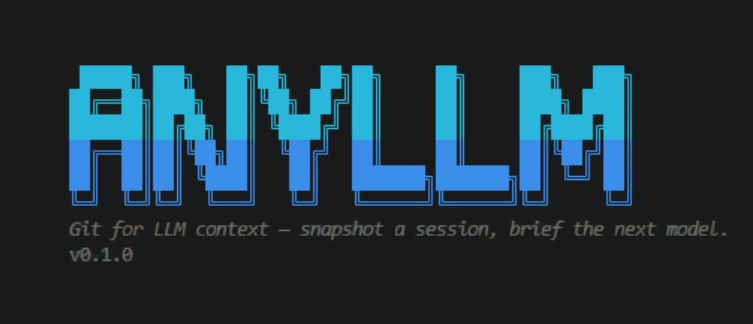

# anyllm — Git for LLM Context

> *Snapshot a dying AI coding session. Brief the next model in 30 seconds. Keep moving.*


You're deep in a Claude Code session. Context window fills. Or you want a second opinion in Codex. Or you switch machines. Either way — the next tool needs the whole project explained again.

**anyllm** snapshots that session into a compact briefing and injects it anywhere: paste it, push it to a browser tab, or let a slash command do it automatically in any of 7 supported AI coding CLIs.

And it doesn't just snapshot the *latest* session. Every `pack` **merges** the new snapshot into a rolling project memory — decisions made three sessions ago survive even if today's session never mentioned them.

---

## Install

```bash
pip install anyllm-ctx
```

Requires Python 3.10+. Set `ANTHROPIC_API_KEY` or `OPENAI_API_KEY` for distillation (required). Add to your shell profile.

---

## First-Run Setup

```bash
cd your-project
anyllm install
```

This does three things in one command:
1. Creates `.anyllm/` in the current project
2. Detects which AI coding CLIs you have installed
3. Installs `/anyllm-pack` (and 7 other commands) into all of them

After that, you never need to leave your AI coding session:

```
/anyllm-pack       ← works in Claude Code, OpenCode, Kiro, Kilocode
$anyllm-pack       ← works in Codex
anyllm-pack        ← type as a message in Antigravity/Agy
```

---

## Commands

| Command | What it does |
|---|---|
| `anyllm init` | Create `.anyllm/` in the current project |
| `anyllm pack` | Snapshot the most recent session, merge into `current.md` |
| `anyllm repack` | Ingest turns missed since the last pack (delta update, no duplicate work) |
| `anyllm prime [--target MODEL] [--copy] [--write PATH]` | Render a briefing for the next model |
| `anyllm push` | Silently inject the briefing into a browser tab and press Send |
| `anyllm status` | Show task, decisions, and repository context state |
| `anyllm log` | Table of every packed session with per-session decision deltas |
| `anyllm diff SESSION_ID` | Show the raw snapshot from a past session |
| `anyllm install` | First-run setup: init + integrate all detected CLIs |
| `anyllm integrate [NAME]` | Install slash commands into one or all detected CLIs |
| `anyllm integrations` | Show which CLIs are detected and installed |
| `anyllm uninstall NAME` | Remove slash commands from a CLI |

---

## CLI Integrations

`anyllm install` (or `anyllm integrate --all`) installs commands into every AI coding CLI you have on the machine. Run `anyllm integrations` to see what's detected and installed.

| CLI | Detection | Invocation | Slash commands |
|---|---|---|---|
| **Claude Code** | `~/.claude/` | `/anyllm-pack` | Zero-token (no AI call) |
| **Antigravity / Agy** | `~/.gemini/` or `agy` binary | type `anyllm-pack` as a message | AI-triggered skill |
| **OpenCode** | `opencode` binary | `/anyllm-pack` | AI-triggered |
| **Codex** | `~/.codex/` | `$anyllm-pack` | AI-triggered |
| **Kiro** | `~/.kiro/` | `/anyllm-pack` | Steering doc |
| **Kilocode** | `~/.kilocode/` | `/anyllm-pack` | Zero-token |
| **Cursor** | `~/.cursor/` | `/anyllm-pack` | Skill directory |

Every integration installs the same 8 commands:

```
/anyllm-init     /anyllm-pack     /anyllm-repack   /anyllm-prime
/anyllm-push     /anyllm-status   /anyllm-log      /anyllm-diff
```

### Claude Code — Zero Token

Claude Code slash commands with `disable-model-invocation: true` run directly in the shell with no AI tokens consumed. `anyllm pack` inside Claude Code costs exactly zero tokens.

### Antigravity / Agy

Antigravity (Google's `agy` CLI) does not support custom slash commands — only built-in `/` commands like `/skills`, `/settings`. Instead, type the command name as a **plain message**:

```
anyllm-pack
```

The installed skill activates automatically and runs `anyllm pack`.

### Manual Integration

Install into a specific CLI without the auto-detect:

```bash
anyllm integrate claude      # Claude Code
anyllm integrate gemini      # Antigravity / Agy
anyllm integrate opencode    # OpenCode
anyllm integrate codex       # Codex
anyllm integrate kiro        # Kiro
anyllm integrate kilo        # Kilocode
anyllm integrate cursor      # Cursor

anyllm integrate --project   # install to .agents/skills/ instead of user config
```

---

## How It Works

```
Ingestor → Distiller → Merger → Composer → Adapter
```

**Ingestor** reads `~/.claude/projects/*.jsonl` (or similar) into a normalized turn-by-turn transcript.

**Distiller** compresses it into a structured snapshot — task, decisions, code map, failed approaches, next step — using your configured LLM.

**Merger** combines the new snapshot with the existing `current.md` instead of overwriting it. Decisions accumulate across sessions. Nothing is silently dropped. Repository analysis (when available) verifies decisions against your actual source code.

**Composer** wraps the snapshot in role framing and anti-repetition guards so the receiving model doesn't re-explore closed questions.

**Adapter** renders the briefing in the format expected by the target (`chatgpt`, `claude`, `cursor`, ...).

### `repack` — Zero-Duplication Delta Update

`anyllm repack` reads only the turns that happened *after* the last pack, distills just those, and merges the delta in. Use it mid-session without re-processing the entire history.

---

## Confidence-Aware Snapshot Merging

Every `pack` classifies every known decision:

| State | Meaning |
|---|---|
| **CONFIRMED** | Re-stated this session, or verified against the codebase |
| **ADDED** | New this session |
| **UPDATED** | Significantly reworded — old wording archived in **Superseded Decisions** |
| **STALE** | Absent from this session, confidence uncertain — surfaced in **Stale / Needs Verification** |
| **ORPHANED** | Code anchor gone and absent for `stale_threshold` consecutive sessions |

Decisions are matched across sessions by normalized hash + character-bigram similarity, so the same decision worded two different ways is recognized as one, not two.

### Sections That Never Get Dropped

- **Failed Approaches** — union of all sessions. If something failed once, every future model knows.
- **Open Questions** — carried forward until a session explicitly resolves one.

### Session Provenance

Every decision tracks which session introduced it and which sessions re-confirmed it. `current.md` includes a `merged_from` list, a `confidence_report` summary, and a `Session Provenance` table. State persists in frontmatter between packs (`decision_provenance`).

### Graceful Degradation

Merging works without any extra tools. If a merge fails, `pack` falls back to a plain write rather than losing the snapshot. Disable merging with `merge.enabled: false`.

---

## Config

`.anyllm/config.yaml` is created by `anyllm init` with defaults:

```yaml
distiller:
  model: gpt-4o-mini
  budget_tokens: 2000

targets:
  default: chatgpt

framing:
  extra_rules: []
  tone: direct

merge:
  enabled: true
  stale_threshold: 3      # consecutive sessions absent before ORPHANED

repository_analysis:
  enabled: true
  timeout: 30             # seconds; subprocess timeout
  auto_refresh: true      # analyze repo automatically on pack

push:
  browser: auto           # auto | chrome | firefox | edge
  codex_url: https://codex.openai.com
  send_delay_ms: 500
  open_if_missing: true
```

---

## Storage Layout

```
.anyllm/
├── config.yaml              # model, target, merge, push settings
├── index.json               # session log with per-session decision deltas
├── current.md               # rolling merged project memory (what prime reads)
└── sessions/
    ├── <date>-<id>.transcript.json   # normalized raw session
    └── <date>-<id>.snapshot.md       # distilled per-session snapshot
```

All files are plain text — hand-editable, diff-able, committable. The `.anyllm/` directory belongs in your repo.

---

## Roadmap

- Additional ingestors: Codex, Gemini, OpenCode, raw markdown
- Additional adapters: Cursor, Gemini, local Llama
- Embedding-based decision matching for better paraphrase handling
- Team workspace sync

---

## Philosophy

Every AI coding session is stateless. You build up context across dozens of turns, and the moment you switch tools — or the context window fills — that shared understanding evaporates.

`anyllm` treats context as a first-class artifact: something you build once, version, and carry forward — not something you reconstruct from memory every time.

The `.anyllm/` directory belongs in your repo. Commit it.
